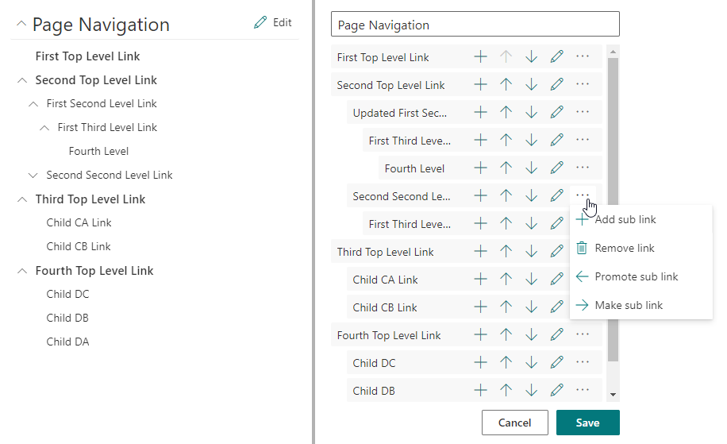

# Page Navigation Web Part
## Summary
SharePoint Framework custom web part which provides page-level navigation with the links stored in a SharePoint list that is provisioned during app installation. 

## Features
- Up to 4 levels of hierarchical links. A link without a specified URL will function as a heading.
- Navigation editor to add, edit, remove, reorder, promote, and demote links.
- Data stored in a SharePoint list named `Page Navigation` which is provisioned on the site during app installation.
- `Edit` button on the web part is security trimmed to users who have permission to edit items in the `Page Navigation` list.
- 1:1 relationship between pages and list items in the `Page Navigation` list.
  - Links are stored as JSON in the `NavigationData` field.
  - Relationship between list item and page is established through the `PageUrl` field containing the server-relative path.
  - List item `Title` field is displayed in the web part as the primary heading.
  - __One__ `Page Navigation` web part is allowed per page.

### Used SharePoint Framework Version

## Setup Instructions
### Pre-requisites
- App Catalog: Ensure the [App Catalog](https://docs.microsoft.com/en-us/sharepoint/use-app-catalog) is setup in your SharePoint Online tenant.

### Tenant Installation
1. Download the latest SPFx package file from [releases](https://github.com/bschlintz/spfx-pagenavigation/releases/latest) or clone the repo and build the package yourself.
1. Upload sppkg file to the 'Apps for SharePoint' library in your Tenant App Catalog.
1. Click Deploy.

### Site Installation
1. Click 'Add an app' on your target site.
1. Click on the `Page Navigation` app to install it.
1. Navigate to a page on the site where you'd like to add the web part, click `Edit` to modify the page.
1. Add the web part named `Page Navigation` to the desired section.
    __Tip:__ Use a narrow column such as the [vertical section](https://support.microsoft.com/en-us/office/add-sections-and-columns-on-a-sharepoint-modern-page-fc491eb4-f733-4825-8fe2-e1ed80bd0899).
1. Save page.
1. Within the web part, click `Enable Page Navigation`. This step will create the list item in the `Page Navigation` list that will store the links for the page.
1. Click `Edit` next to the Page Navigation heading to begin adding links.
1. Click `Add Link` to add your first link.
1. Click `Save` on the web part when finished adding links.

## Version history

Version|Date|Comments
-------|----|--------
1.1.0|April 26, 2021|Add support for headings
1.0.1|October 20, 2020|Minor bug fixes
1.0.0|October 7, 2020|Initial release

## Disclaimer
Microsoft provides programming examples for illustration only, without warranty either expressed or implied, including, but not limited to, the implied warranties of merchantability and/or fitness for a particular purpose. We grant You a nonexclusive, royalty-free right to use and modify the Sample Code and to reproduce and distribute the object code form of the Sample Code, provided that You agree: (i) to not use Our name, logo, or trademarks to market Your software product in which the Sample Code is embedded; (ii) to include a valid copyright notice on Your software product in which the Sample Code is embedded; and (iii) to indemnify, hold harmless, and defend Us and Our suppliers from and against any claims or lawsuits, including attorneys' fees, that arise or result from the use or distribution of the Sample Code.

## References
- [Getting started with SharePoint Framework](https://docs.microsoft.com/en-us/sharepoint/dev/spfx/set-up-your-developer-tenant)
- [Building for Microsoft teams](https://docs.microsoft.com/en-us/sharepoint/dev/spfx/build-for-teams-overview)
- [Use Microsoft Graph in your solution](https://docs.microsoft.com/en-us/sharepoint/dev/spfx/web-parts/get-started/using-microsoft-graph-apis)
- [Publish SharePoint Framework applications to the Marketplace](https://docs.microsoft.com/en-us/sharepoint/dev/spfx/publish-to-marketplace-overview)
- [Microsoft 365 Patterns and Practices](https://aka.ms/m365pnp) - Guidance, tooling, samples and open-source controls for your Microsoft 365 development
